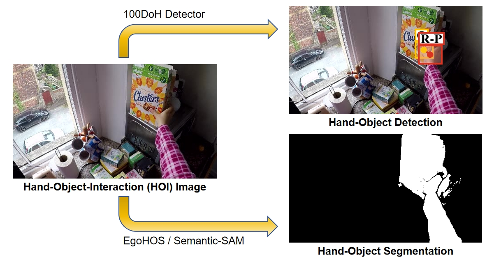
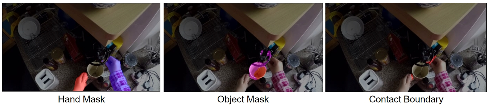
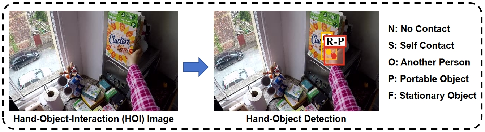
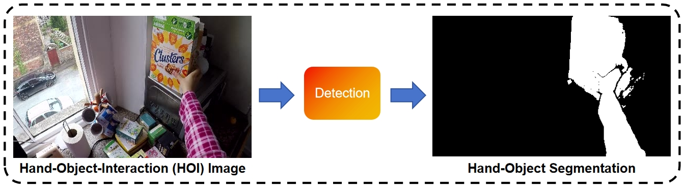

# Egocentric Hand, Object and Dynamic Area Detection and Segmentation



## Updatation (2024.07.14)

I find that [EgoHOS](https://github.com/owenzlz/EgoHOS) produce better hand-object segmentation than [100DoH](https://github.com/ddshan/hand_object_detectorc) + [Semantic-SAM](https://github.com/UX-Decoder/Semantic-SAM) pipeline. I have also provided a wrapper of EgoHOS in ``ego_hos_wrapper.py``.

First install EgoHOS from the official repository, than run the code below for segmentation:

```python
from ego_hos_wrapper import EgoHOSWrapper
base_fp = "image.jpg"
ego_hos_wrapper = EgoHOSWrapper(cache_path="/home/ycb/dflowmap_project/dflowmap/dfm/hoi/cache",  # an absolute file-path for caching
                                repo_path='../repo')
seg_hands, seg_obj2, seg_cb = ego_hos_wrapper.segment(image_fp, vis=True)  # "cb" is contact boundary
```

If you install mmcv with version ``2.x`` rather than 1.6.0 from the original EgoHOS repository, you may need to replace ``EgoHOS/mmsegmentation/mmseg/apis/inference.py`` with ``ego_hos_inference.py`` I provided.



## Introduction

This repository is a pipeline for hand object interaction (HOI) analysis, which includes: 

(1) hand object state and position detection. 

(2) hand and object segmentation. 

(3) dynamic area segmentation. 

This repository is based on [100DoH](https://github.com/ddshan/hand_object_detectorc) for state and position detection, [Semantic-SAM](https://github.com/UX-Decoder/Semantic-SAM) for segmentation and [General-Flow](https://github.com/michaelyuancb/general_flow) codebase for post-processing. The whole pipeline is as follows: (1) 100DoH is used to detect the contact/manipulation state and bbox position. (2) The center point of each active bbox is used as prompt of Semantic-SAM for segmentation. The mask with max area size is chosen as a conservative mask estimation. (3) All masks in the previous step are merged into the dynamic-area mask.

I also fix the bugs in the compilation  of [100DoH](https://github.com/ddshan/hand_object_detectorc) caused by the upgrade of pytorch and CUDA, and the bugs in [Semantic SAM]((https://github.com/UX-Decoder/Semantic-SAM)) caused by the loss of package for its [detectron2](https://github.com/facebookresearch/detectron2) dependencies. 

Hope this repository can help you : )

## Installation

my environment: python3.11, CUDA11.7, cudatoolkit11.7, torch=='2.0.1+cu117'.

### Installation of 100DoH

First use the 100DoH repository I provided in ``ego_hand_detector/`` to install the 100DoH hand-object detector. You can refer to ``ego_hand_detector/README.md``. 

Note that if you used the [original 100DoH repository](https://github.com/ddshan/hand_object_detector), you may meet problems since it only support for low-version CUDA. 

### Installation of Semantic-SAM

First get the Semantic-SAM repository from [here](https://github.com/UX-Decoder/Semantic-SAM).

```
git clone https://github.com/UX-Decoder/Semantic-SAM.git
```

Then install the repository according to the ``Semantic-SAM/README.md``.

If you meet the problem ``MultiScaleDeformableAttention Module is not Found`` in the later process, you may solved it as below:

```
cd ops
./make.sh
```

## Egocentric Hand & Object Detection



Run the following code as demo:

```python
from ego_hoi_detection import EgoHOIDetection
base_fp = "image.jpg"
ego_hoi_detector = EgoHOIDetection(repo_path='.')
det_result = ego_hoi_detector.detect(base_fp, vis=True)
```

The struction of ``det_result`` is as follows:
```
{
      'left': {...}
      'right': 
      {
            'offset': array([ 0.02586488, -0.02177986, -0.09759938]), 
            'bbox_obj': array([295.7385 ,  84.01411, 340.0573 , 124.14677]), 
            'bbox_hand': array([303.76373,  91.89891, 360.7369 , 138.00621]), 
            'confidence_hand': 0.99910814, 
            'state': 'P', 
            'state_explaination': 'Portable Object'}
      }
}
```

The visualization result will be saved in ``vis_det.png``. Check out [100DoH](https://github.com/ddshan/hand_object_detector) and ``ego_hoi_detection.py`` for more details. 

## Egocentric Hand & Object & Dynamic-Area Segmentation (Conservative)



Run the following code as demo:

```python
from ego_hoi_segmentation import EgoHOISegmentation
base_fp = "image.jpg"
ego_hoi_segmentation = EgoHOISegmentation(repo_path='../repo')
seg_result, det_result = ego_hoi_segmentation.segment(image_fp, hand_threshold=0.2, vis=True)
```

The struction of ``seg_result`` is a dict (e.g. dict_keys(['left_hand', 'left_obj', 'dynamic_area'])) with (H×W) numpy value of each key. Note that we pick up the mask with max area size of Semantic-SAM for conservative estimation. Check out [the original repository](https://github.com/UX-Decoder/Semantic-SAM) and ``ego_hoi_segmentation.py`` for more details. 

## BibTeX

```bibtex
@article{yuan2024general,
  title={General Flow as Foundation Affordance for Scalable Robot Learning},
  author={Yuan, Chengbo and Wen, Chuan and Zhang, Tong and Gao, Yang},
  journal={arXiv preprint arXiv:2401.11439},
  year={2024}
}
```

## Acknowledgements

This repository is based on the code from [100DoH](https://github.com/ddshan/hand_object_detector), [Semantic-SAM](https://github.com/UX-Decoder/Semantic-SAM), [EgoHOS](https://github.com/owenzlz/EgoHOS), [General-Flow](https://github.com/michaelyuancb/general_flow) and [Deformable-DETR](https://github.com/fundamentalvision/Deformable-DETR). Thanks a lot : )